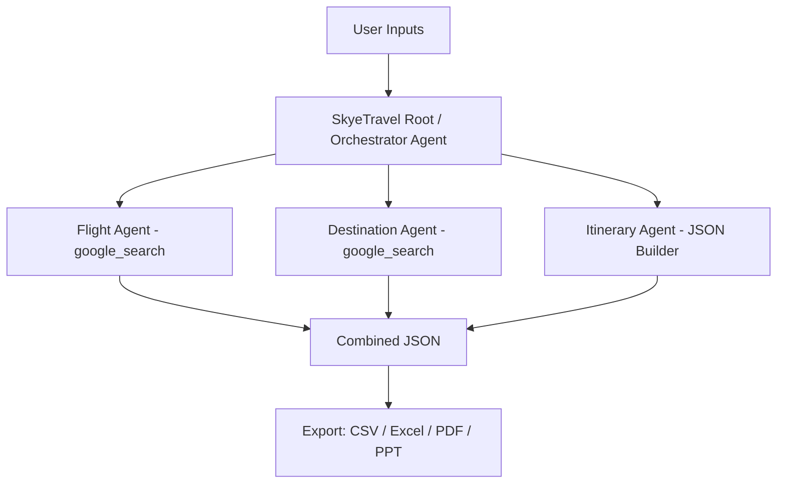

# SkyeTravel — AI-Powered Multi-Agent Travel Concierge
[](https://colab.research.google.com/github/AbhishekRK41/SkyeTravel/blob/main/skyetravel.ipynb)

SkyeTravel is a multi-agent travel planner built on the Google Agent Development Kit (ADK) and Gemini models. It takes trip parameters, researches flights/hotels/attractions with live web search, assembles a full itinerary, and exports it as CSV, Excel, PDF, and PPT.

## Problem

Planning a trip means juggling flight search, hotel comparisons, and attraction research across a dozen tabs, then manually stitching it all into a day-by-day plan. SkyeTravel automates that research-and-assembly loop.

## How it works

SkyeTravel delegates responsibility across specialized agents orchestrated by a root agent:

- **Flight Agent** — searches for flight options via `google_search`
- **Destination Agent** — searches for hotels and attractions
- **Itinerary Agent** — merges everything into a structured day-by-day JSON plan



## Features

- Real-world flight/hotel/attraction data via the `google_search` tool
- Custom itinerary-joining tool to merge agent outputs
- Session/state management via `InMemoryRunner`
- Export to CSV, Excel, PDF, and PowerPoint
- Runs end-to-end inside a single notebook

## Setup

**Requirements:**
- Python 3.10+
- A Google API key (Gemini access), stored as a Kaggle secret named `GOOGLE_API_KEY` (or set as an environment variable if running elsewhere)

```bash
pip install -q python-pptx reportlab nest-asyncio openpyxl google-adk
```

## Usage

1. Open `skyetravel.ipynb` in Kaggle or Colab.
2. Set `GOOGLE_API_KEY` in your notebook secrets/environment.
3. Set your trip parameters in the config cell.
4. Run all cells — the agents research and assemble the itinerary, then export it to your chosen formats.

A plain-script version of the pipeline is included as `Code` — consider renaming it to `skyetravel.py` so GitHub applies Python syntax highlighting to it.

## License

See [LICENSE](./LICENSE).
